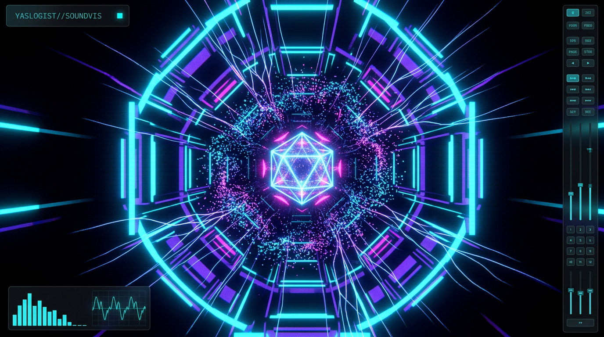

# YASLOGIST SOUNDVIS - Audio-Reactive VJ Engine



> **YASLOGIST SOUNDVIS** is an ultra-high-performance, standalone, hardware-accelerated **audio-reactive 3D visualizer and live VJ performance engine** engineered for industrial, acid, and melodic techno. Built with cutting-edge WebGL2, Three.js, React Three Fiber, custom GLSL shaders, and real-time Web Audio API signal processing.

---

## ⚡ Overview & First Principles

YASLOGIST SOUNDVIS is architected for zero-latency, stutter-free 60+ FPS performance during live electronic music performances, stage projections, and VJ sets. 

Everything is computed and rendered **100% client-side** in real-time — with **zero external assets, zero network calls, zero tracking, and zero GC pressure**.

```
                           ┌────────────────────────────────────────┐
                           │          Audio Input Source            │
                           │  (Internal Synth / Mic / Sys / File)   │
                           └───────────────────┬────────────────────┘
                                               │
                                               ▼
                           ┌────────────────────────────────────────┐
                           │      Web Audio API Signal Graph        │
                           │  FFT 1024 · 4-Band Splitting · RMS     │
                           └───────────────────┬────────────────────┘
                                               │
                         ┌─────────────────────┴─────────────────────┐
                         │                                           │
                         ▼                                           ▼
             ┌────────────────────────┐                 ┌─────────────────────────┐
             │ Global Mutable State   │                 │ Direct DOM HUD Bridge   │
             │ (audioState - No React)│                 │ (hudBridge - 0 Re-render│
             └───────────┬────────────┘                 └─────────────────────────┘
                         │
                         ▼
             ┌────────────────────────┐
             │ R3F Frame Loop (GPU)   │
             │ 3D SDF / GLSL Shaders  │
             └────────────────────────┘
```

---

## 🏛️ System Architecture

* **React 19 & React Three Fiber (R3F)**: Declarative scene hierarchy with strictly decoupled animation loops.
* **Three.js (r180)**: Native WebGL2 rendering pipeline with instanced meshes, custom shader materials, and dynamic buffer geometries.
* **Custom GLSL 3.0 Shaders**: Ashima 3D Simplex noise, FBM, raymarched signed distance field (SDF) infinite tunnels, and cosmic plasma fragment routines.
* **Zero React Loop Overhead**: The audio engine writes directly to typed numeric arrays in `audioState`; `useFrame` pipes values directly to `ShaderMaterial.uniforms` and GPU instance matrices.
* **Post-Processing Pipeline**: Multi-stage `postprocessing` effect composer featuring Bloom, Chromatic Aberration, Vignette, Film Grain, Scanlines, and Hardware-Protected Auto-Recovery fallback tiers.

---

## 🌟 Core Features & Hyper-Dimensional FX

### 1. 🎛️ Glassmorphism HUD Control Dock
* **Collapsible Floating Dock**: Sleek cyberpunk aesthetic with strict Tailwind CSS glassmorphism (`backdrop-blur-2xl`, subtle cyan glow, custom thin scrollbar).
* **Zen Mode (`👁 ZEN`)**: Complete UI collapse into a minimal trigger badge, leaving the viewport **100% clean and unobstructed** for live stage visual projections.
* **Live Analysis Console**: Real-time 64-bin FFT spectrum analyzer, time-domain oscilloscope, and transient sub/bass/mid/high VU meters.

### 2. 🌀 Quantum Portal (Custom GLSL Plasma)
* Multi-ring instanced torus geometry that counter-rotates dynamically.
* Angular rotation speed is locked to the **Highs** frequency band ($5\text{ kHz} - 16\text{ kHz}$), accelerating violently on hi-hat and cymbal strikes.
* Driven by a custom GLSL fragment shader simulating harmonic cosmic plasma flow and luminescent Fresnel rim edge glow.

### 3. ⚡ Neural Synapses
* Radial filament burst system built with `THREE.LineSegments`.
* Strictly triggered upon **Bass & Sub** transient peak thresholds ($>0.58$), shooting randomized high-velocity energy paths outward from the singularity core.

### 4. 💥 The "Drop" Impact Dynamics
* Real-time broadband RMS and sub-bass surge detector.
* When a massive drop or heavy transient hits:
  * **Camera FOV Punch**: Instantly explodes the perspective field of view outward ($+22^\circ$) and spring-damps back into groove.
  * **3x Bloom Flare**: Supercharges global luminescent bloom by $300\%$ for an explosive visual flash.

### 5. 💎 Crystalline Glitch
* Global chromatic aberration pass with prismatic RGB dispersion, high-frequency audio flutter, and interactive intensity control.

### 6. ⏱️ Master Clock Synchronization
* Synchronizes visual animation phases, particle orbits, and synth patterns to a central BPM phase ($0.0 \dots 1.0$) for razor-sharp temporal alignment.

### 7. 🎨 20 Curated Color Palettes & 12 Base Geometries
* Includes *Laser Cyan*, *Acid Neon*, *Ultraviolet*, *Glitch White*, *Infrared*, *Toxic Magenta*, *Solar Gold*, *Biohazard*, *Matrix Code*, *Liquid Gold*, *Void Matter*, and more.
* 12 morphable geometric shapes including Icosahedrons, Torus Knots, Octahedrons, Hyper-Cubes, and Liquid Metal vertex displacement.

### 8. 🎹 Built-In Procedural 132 BPM Acid Techno Synthesizer
* Dual-oscillator pitched sub-bass kick drum, 303 resonant acid bassline, industrial 909-style closed/open hats, and analog noise sweep generator.
* Live Tap-BPM tempo calculator and frequency profile EQ curve selector (*Smooth*, *Standard*, *Dynamic*, *Hyper*).

---

## 📸 Snapshot & Promo Capture Utility

* **`[CAPTURE SNAPSHOT]`**: Located prominently at the base of the Glassmorphism dock. Reads the active WebGL framebuffer (`preserveDrawingBuffer: true`) and downloads `yaslogist-soundvis-preview.png` in pristine full-resolution lossless PNG.
* **60 FPS Video Recorder**: Built-in MediaRecorder engine muxes real-time WebGL video with the source audio stream into `.webm` / `.mp4` performance clips.

---

## 🚀 Setup & Installation

### Prerequisites
* **Node.js**: v18.0.0 or higher
* **npm** or **pnpm** / **yarn**

### Quickstart

```bash
# 1. Clone or navigate to the repository
cd SOUNDVIS

# 2. Install dependencies
npm install

# 3. Start development server (with Vite HMR)
npm run dev

# 4. Open in your browser
# => http://localhost:5173
```

### Production Build

```bash
# Type-check and compile single-file distribution bundle
npm run build

# Preview production build locally
npm run preview
```

> The production build compiles into a **single self-contained `dist/index.html`** file via `vite-plugin-singlefile`. It can be run locally off-grid or deployed instantly to Cloudflare Pages, Vercel, Netlify, or GitHub Pages.

---

## ⌨️ Keyboard Shortcuts & Hotkeys

| Key | Action |
| :--- | :--- |
| <kbd>SPACE</kbd> | Toggle Play / Pause Audio Source |
| <kbd>H</kbd> | Toggle HUD Interface Visibility |
| <kbd>Z</kbd> | Toggle Zen Performance Mode |
| <kbd>F</kbd> | Toggle Fullscreen Mode |
| <kbd>P</kbd> | Capture Instant PNG Snapshot (`yaslogist-soundvis-preview.png`) |
| <kbd>R</kbd> | Start / Stop 60 FPS Video Recording |
| <kbd>1</kbd> – <kbd>9</kbd> | Quick-Select Preset Palettes |
| <kbd>?</kbd> | Open Shortcuts & System Diagnostics Sheet |

---

## ⚙️ Hardware Optimization

Optimized for **Apple Silicon (M1/M2/M3/M4, Metal)** and modern dedicated GPUs (NVIDIA RTX / AMD Radeon):
* Adaptive performance governor automatically balances render resolution, particle draw-range, and post-FX passes to maintain locked **60+ FPS**.
* Native FP32 vector math and branchless GLSL fragment routines.

---

## 📄 License & Attribution

Architected & Engineered by **Ahmed Yasser (YASLOGIST)**.  
Released under the **MIT License**.
