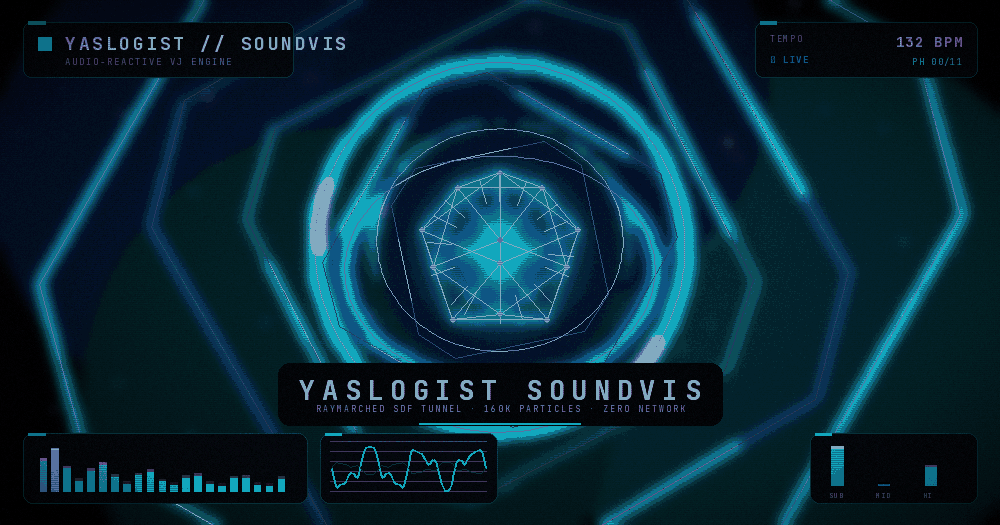
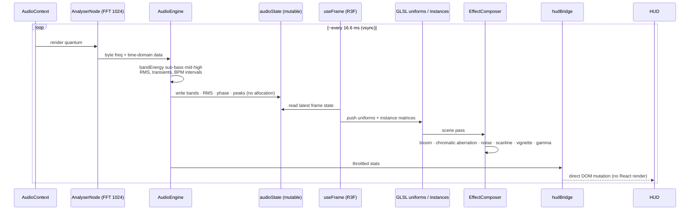

<div align="center">

<br/>

# YASLOGIST SOUNDVIS

### Audio-Reactive 3D Visualizer & Live VJ Performance Engine

**Technical Whitepaper · v1.0**

[](https://github.com/YASLOGIST/yaslogist-soundvis/actions/workflows/ci.yml)


[](LICENSE)



*Stylised programmatic render of the engine's aesthetic — regenerated by [`scripts/generate_og.py`](scripts/generate_og.py). Fire up `npm run dev` for the real thing.*

</div>

---

## Abstract

**YASLOGIST SOUNDVIS** is a standalone, hardware-accelerated **audio-reactive 3D visualizer and live VJ performance engine** engineered for industrial, acid, and melodic techno. It converts live audio — internal synth, microphone, system loopback, or file playback — into a raymarched, beat-phase-locked WebGL2 stage at a stutter-free 60+ FPS, inside a single self-contained HTML file that runs fully offline.

The engine is built on a deliberately unusual contract: **React never re-renders inside the animation loop**. A singleton audio graph writes band energies into mutable typed state; the R3F frame loop reads that state and pipes it straight into GLSL uniforms and GPU instance buffers. The HUD is driven over a direct DOM bridge for the same reason. The result is zero reconcile work, zero allocation churn, and zero GC pressure on the performance-critical path.

| Headline metric | Value |
| :-- | :-- |
| Distribution format | **1 × `index.html`** (all code, fonts, shaders inlined) |
| Runtime network calls | **0** — works off-grid, airplane mode, USB stick |
| Particle budget | up to **200 000** points (GODMODE quality) |
| Audio analysis | FFT-1024 → 512 bins, 4-band split, smoothing 0.82 |
| Visual language | 20 curated palettes × 12 morphable core geometries |
| Look memory | 8 preset slots · F1–F8 · shareable `#look=` URLs · JSON I/O |
| Hardware control | Web MIDI — CC 20–27 macro row, pads 36–47, hot-plug |
| Safety | Photosensitive SAFE mode (~3 Hz flash ceiling, one keystroke) |
| Verification | 65 unit tests · typecheck · lint · format · CI-gated build |

---

## Contents

1. [System Architecture](#01--system-architecture)
2. [Tech Stack](#02--tech-stack)
3. [Feature Matrix](#03--feature-matrix)
4. [Core Workflows](#04--core-workflows)
5. [Safety & Performance Engineering](#05--safety--performance-engineering)
6. [Control Reference](#06--control-reference)
7. [Getting Started](#07--getting-started)
8. [Brand & Social Media Assets](#08--brand--social-media-assets)
9. [Security & Privacy](#09--security--privacy)
10. [Repository Map](#10--repository-map)
11. [License & Attribution](#license--attribution)

---

## 01 · System Architecture

### 1.1 Design Invariants

| # | Invariant | Enforcement |
| :- | :-- | :-- |
| I-1 | **No React in the frame loop.** State that changes at 60 Hz lives outside the component tree. | `audioState` singleton + `hudBridge` direct-DOM writes (`src/audio/state.ts`) |
| I-2 | **One render, one GPU pipeline.** Projector mirroring reuses `canvas.captureStream()` instead of a second context. | `src/output/outputWindow.ts` |
| I-3 | **Every external input is hostile until proven otherwise.** Persisted settings, imported presets, share URLs and MIDI values all pass one declarative sanitizer. | `sanitizeSettings()` + `parseLook()` |
| I-4 | **The show must survive weak hardware and GPU faults.** Tiered quality governor, photosensitivity limiter, fault bus + boundary with auto-recovery. | `perfBridge`, `src/three/safety.ts`, `src/ui/faultBus.ts`, `src/ui/ErrorBoundary.tsx` |
| I-5 | **Offline is a feature, not a constraint.** No CDN, no telemetry, fonts bundled, single-file build. | `vite-plugin-singlefile`, zero runtime `fetch` |

### 1.2 Component Topology


```mermaid
flowchart LR
  subgraph INPUT["Audio Input"]
    SYNTH["Internal Synth<br/>132 BPM acid loop"]
    MIC["Microphone"]
    SYS["System Loopback"]
    FILE["File Playback"]
  end

  subgraph DSP["AudioEngine · Web Audio graph"]
    AN["AnalyserNode<br/>FFT 1024 · smoothing 0.82"]
    BANDS["4-band split<br/>sub · bass · mid · high"]
    TR["RMS + transient detectors"]
    BPM["Auto-BPM estimator<br/>octave folding 70–180"]
  end

  STATE[("audioState<br/>mutable typed buffers<br/>(React-free)")]
  BRIDGE[/"hudBridge<br/>direct-DOM writes"/]

  subgraph GPU["R3F · Three.js WebGL2 stage"]
    FR["useFrame loop"]
    UNI["ShaderMaterial uniforms<br/>instanced buffers"]
    SCN["Scene: tunnel · core · particles<br/>portal rings · synapses"]
    PP["EffectComposer<br/>bloom · CA · noise · scanlines · vignette"]
  end

  HUD["HUD<br/> Tailwind glass dock + analysis console"]
  MIDI["MidiManager"]  -->|CC scale via sanitizer spec| PATCH["settings patch"]
  KEY["Keyboard surface"] --> PATCH
  PATCH --> GPU

  INPUT --> DSP
  DSP --> STATE
  DSP --> BRIDGE
  STATE --> FR
  FR --> UNI --> SCN --> PP
  PP --> OUT["WebGL canvas"]
  OUT -->|"captureStream 60 fps"| PROJ["Projector window"]
  OUT --> SNAP["PNG snapshot · MediaRecorder"]
  BRIDGE --> HUD
```

### 1.3 Subsystem Reference

| Module | Responsibility | Key facts |
| :-- | :-- | :-- |
| `src/audio/AudioEngine.ts` | Source acquisition, FFT analysis, band energies, RMS, transients | FFT 1024 → 512 bins; smoothing 0.82; typed AudioEngineError surfaces |
| `src/audio/bpm.ts` | Tempo estimation from inter-beat intervals | Pure math, unit-testable, no Web Audio dependency; median + octave fold |
| `src/audio/DemoSynth.ts` | Built-in deterministic 132 BPM techno loop | Sub-kick, 303 acid line, 909 hats, noise sweep; tempo clamp 60–200 |
| `src/audio/state.ts` | Global mutable state, settings schema, quality presets, 20 palettes | Sanitizer spec doubles as MIDI scaling table; legacy key migration built in |
| `src/three/Scene.tsx` | Declarative scene graph: backdrop, tunnel, core, rings, particles, towers, shockwaves | Per-quality raymarch steps; `perfBridge` draw-range control |
| `src/three/shaders.ts` | Custom GLSL 3.0 library | Ashima simplex noise, FBM, SDF tunnel, plasma, gamma pass |
| `src/three/safety.ts` | Photosensitivity limiter math | Constants-driven; pure functions, fully unit-tested |
| `src/presets/lookPresets.ts` | Look bank: 8 slots, base64url share links (`#look=…`), JSON transport | Versioned (`PRESET_VERSION = 1`), hardened `parseLook` validator |
| `src/midi/MidiManager.ts` | Web MIDI hot-plug surface | CC 20–27 → 8 macros; pads 36–47 → palette/zen/SAFE/preset actions |
| `src/media/Recorder.ts` | PNG stills + MediaRecorder video mux | VP9→VP8→H.264→MP4 codec negotiation; 60 fps canvas stream |
| `src/output/outputWindow.ts` | Borderless projector mirror | One GPU context; click-to-fullscreen; close-to-stop |
| `src/ui/Hud.tsx` | Glassmorphism control dock, spectrum console, VU meters | Zen mode collapse; toasts via fault bus |
| `src/ui/faultBus.ts` · `src/ui/ErrorBoundary.tsx` | Global fault telemetry + render-loop isolation | Auto-recovery tiers for post-processing failures |
| `src/App.tsx` | Boot gate, settings persistence, keyboard surface, governor | Stage memoized — re-renders only on real settings deltas |

---

## 02 · Tech Stack

### 2.1 Runtime

| Layer | Technology | Version | Role |
| :-- | :-- | :-- | :-- |
| Language | TypeScript (strict) | 5.9.3 | All sources typed; `tsc --noEmit` gate on every build |
| UI shell | React | 19.2.6 | Stage, dock, boundaries — memoized outside the hot loop |
| 3D renderer | Three.js | 0.180.x | WebGL2 pipeline, instancing, dynamic buffers, `ShaderMaterial` |
| React-3D bridge | @react-three/fiber | 9.3.0 | Declarative scene + `useFrame` loop |
| Post-processing | postprocessing + @react-three/postprocessing | 6.37.8 / 3.0.4 | Bloom, ChromaticAberration, Glitch, Noise, Scanline, Vignette |
| Shading | GLSL ES 3.0 | — | Custom SDF/plasma/particle programs, branchless FX math |
| Audio | Web Audio API | native | AnalyserNode FFT, oscillator/noise synthesis, `AudioContext` |
| CSS | Tailwind CSS | 4.1.17 | Glass utility layer, custom thin scrollbars, dock layout |
| Class combiner | clsx + tailwind-merge | 2.1.1 / 3.4.0 | `cn()` helper for conditional UI classes |

### 2.2 Toolchain

| Stage | Tool | Version | Notes |
| :-- | :-- | :-- | :-- |
| Build / dev server | Vite | 7.3.2 | HMR dev loop; Node ≥ 20.19 required |
| Bundling | vite-plugin-singlefile | 2.3.0 | Inlines JS/CSS/fonts → one HTML artifact |
| Unit tests | Vitest | 4.0.15 | 65 tests across 5 suites, no DOM required |
| Lint | ESLint + typescript-eslint + react-hooks | 9.39.2 / 8.48.1 / 7.0.1 | Flat config |
| Format | Prettier | 3.7.4 | `format:check` enforced in CI |
| CI | GitHub Actions (Node 22) | — | typecheck → lint → format → test → build → artifact |

### 2.3 Target Environment

| Capability | Minimum | Used for |
| :-- | :-- | :-- |
| WebGL2 + float textures | required | Entire render pipeline |
| Web Audio API | required | Analysis + internal synth |
| MediaRecorder + `canvas.captureStream` | optional | Video recording, projector mirror |
| Web MIDI | optional | Hardware control surface |

---

## 03 · Feature Matrix

| # | Subsystem | Capability | Specification / Behaviour | Control surface |
| :- | :-- | :-- | :-- | :-- |
| F-01 | **Signal Analysis** | Real-time FFT | 1024-sample window → 512 bins ≈ 46.9 Hz resolution @ 48 kHz; smoothing 0.82 | automatic |
| F-02 | **Signal Analysis** | 4-band isolation | sub 20–120 Hz · bass 120–400 Hz · mid 400–2.5 kHz · high 5–16 kHz | automatic |
| F-03 | **Signal Analysis** | Transient dynamics | Per-band attack/release envelopes (e.g. kick-fast attack 0.85, slow release 0.25) | EQ profile selector (*Smooth · Standard · Dynamic · Hyper*) |
| F-04 | **Tempo** | Auto-BPM | Median of inter-beat intervals, octave-folded into 70–180 BPM, outlier-rejected confidence score | automatic + Tap-BPM |
| F-05 | **Tempo** | Master clock | Phase-integrated clock: tempo changes accelerate the visual phase smoothly — zero jumps | governed by F-04 confidence |
| F-06 | **Core Geometry** | 12 morphable bodies | Icosahedron, Torus Knot, Sphere, Octahedron, Dodecahedron, Tetrahedron, Diamond, Hex Prism, Tech Ring, Hyper Knot, Liquid-Metal displacement | dock / preset / MIDI-adjacent |
| F-07 | **Colour** | 20 curated palettes | Laser Cyan → Neon Platinum; keys `1–9`/`0` hot-select first ten; Auto-Look advances on 32-beat phrases | dock / keys / pads / presets |
| F-08 | **Quantum Portal** | Multi-ring plasma torus | Counter-rotating instanced rings; angular velocity locked to the high band; Fresnel rim glow | tied to F-02 highs |
| F-09 | **Neural Synapses** | Radial filament bursts | `THREE.LineSegments` burst fired when bass/sub transient peaks exceed 0.58 | tied to F-02/F-03 |
| F-10 | **Impact Dynamics** | “Drop” detection | Broadband RMS + sub surge ⇒ FOV punch (+22°, spring-damped) and 3.0× bloom flare | automatic |
| F-11 | **Crystalline Glitch** | Chromatic aberration | RGB dispersion with audio-band flutter; full-screen glitch bursts (`G`) | dock / key / CC 21 |
| F-12 | **SAFE Mode** | Photosensitive protection | Strobe ≤ ~3 Hz · flash ≤ 1.25× · FOV punch × 0.3 · chroma spike × 0.5 · glitch bursts suppressed | `S` key / dock / pad 39 |
| F-13 | **Look Bank** | Presets | 8 slots capture aesthetics (not machine prefs); click recall ⇧-store alt-clear; `F1–F8` / `⇧F1–F8` | keys / dock / pads 40–47 |
| F-14 | **Look Bank** | Transport | JSON export/import + `#look=` base64url share links; all inbound data passes the hardened validator | dock buttons |
| F-15 | **MIDI Surface** | Zero-config controller | CC 20–27 → bloom · glitch · speed · intensity · trails · particle size · core size · sensitivity; pads 36–47 → palettes/zen/SAFE/slots; hot-plug status in dock | `∘ MIDI` dock button |
| F-16 | **Output** | Projector mirror | `captureStream(60)` into borderless pop-out; click = fullscreen; close = end mirror | `O` key / `⧉ OUT` |
| F-17 | **Capture** | Stills & video | Full-res PNG from the live framebuffer (`preserveDrawingBuffer`); WebM (VP9/VP8/H.264) or MP4 via MediaRecorder with muxed source audio | `P` / `R` keys, dock |
| F-18 | **HUD** | Glass control dock | Collapsible, custom scrollbar, live spectrum + oscilloscope + VU meters | `H` hide / `Z` zen |
| F-19 | **Zen Mode** | Projection-clean viewport | Full interface collapse to a minimal trigger badge | `Z` / dock / pad 38 |
| F-20 | **Governor** | Adaptive performance | Auto quality: DPR, particle draw-range and FX passes scale to hold 60+ FPS | `A` key / quality tier |
| F-21 | **Quality Tiers** | 4 presets | ECO → GODMODE (see §5.2) | dock selector |
| F-22 | **Demo Synth** | Self-contained audio source | Deterministic 132 BPM acid loop: sub-kick, 303, 909 hats, noise sweep; no asset download | source selector / tap tempo |
| F-23 | **Storage** | Settings persistence | Sanitized JSON in `localStorage`, transparent migration from `void-reactor.settings.v1` | automatic |
| F-24 | **Resilience** | Fault containment | Fault bus + boundary; post-processing degradation tiers; global error traps with operator toasts | automatic |

---

## 04 · Core Workflows

### 4.1 The Frame Pipeline (audio → photons)

Every animation frame executes the same deterministic sequence:


```mermaid
sequenceDiagram
  participant AC as AudioContext
  participant AN as AnalyserNode (FFT 1024)
  participant AE as AudioEngine
  participant ST as audioState (mutable)
  participant RF as useFrame (R3F)
  participant SH as GLSL uniforms / instances
  participant PP as EffectComposer
  participant HB as hudBridge

  loop ~every 16.6 ms (vsync)
    AC->>AN: render quantum
    AN->>AE: byte freq + time-domain data
    AE->>AE: bandEnergy sub·bass·mid·high<br/>RMS, transients, BPM intervals
    AE->>ST: write bands · RMS · phase · peaks (no allocation)
    RF->>ST: read latest frame state
    RF->>SH: push uniforms + instance matrices
    SH->>PP: scene pass
    PP->>PP: bloom · chromatic aberration · noise · scanline · vignette · gamma
    AE->>HB: throttled stats
    HB-->>HUD: direct DOM mutation (no React render)
  end
```

**Why it scales:** the loop performs zero React reconciliation, zero object allocation beyond ring-buffer overwrites, and one draw pipeline even while mirroring to a projector window.

### 4.2 Boot & Input Acquisition

1. **Boot gate** — feature-detect WebGL2, AudioContext, float render targets; hard-stop with a typed error panel if the GPU stack is missing.
2. **Source select** — `synth` (instant, offline) · `mic` (`getUserMedia`) · `system` (screen-share loopback) · `file` (user’s track, with `←`/`→` ±5 s seek).
3. **Graph wiring** — chosen source → AnalyserNode (+ studio-safe monitor path for file playback).
4. **Failure paths** — permission denials, missing devices and decode errors surface as typed `AudioEngineError` toasts; built-in synth always remains as a zero-dependency fallback.

### 4.3 Look Preset Lifecycle

| Stage | Action | Guarantee |
| :-- | :-- | :-- |
| Capture | `⇧`+click slot (or `⇧F1–F8`) | `extractLook()` snapshots only aesthetic fields via `LOOK_FIELDS` |
| Persist | automatic | `localStorage` bank, versioned envelope (`PRESET_VERSION = 1`) |
| Recall | click slot / `F1–F8` / pad 40–47 | values re-enter through `applyLook()` → sanitizer-constrained patch |
| Share | copy link | `encodeLook()` → base64url `#look=…` — entire look travels in the URL |
| Import | JSON file / shared URL | `parseLook()` structural validation; anything malformed is rejected, never coerced |
| Clear | `alt`+click slot | slot returns to empty |

**Security property:** the sanitizer spec (ranges, enums, integer fields, type matching) is the *same* table used by MIDI CC scaling and settings persistence — one hardened boundary for every untrusted value.

### 4.4 MIDI Live Surface (zero mapping setup)

| Hardware event | Engine action |
| :-- | :-- |
| CC 20–27 | bloom · crystalline glitch · speed · intensity · trails · particle size · core size · input sensitivity |
| Note 36 / 37 | palette next / previous |
| Note 38 / 39 | zen toggle / SAFE toggle |
| Notes 40–47 | recall look slots 1–8 |

CC values are scaled into persisted-safe ranges *by the sanitizer spec itself*, so a controller can never push an out-of-domain value. Devices hot-plug mid-set; the dock header shows live connection state.

### 4.5 Capture & Output

| Workflow | Trigger | Behaviour |
| :-- | :-- | :-- |
| PNG snapshot | `P` | Reads the live framebuffer (`preserveDrawingBuffer: true`), downloads lossless full-res PNG |
| Video clip | `R` | `canvas.captureStream(60)` + source audio → MediaRecorder; codec negotiation VP9 → VP8 → H.264 → MP4 fallback |
| Projector mirror | `O` | Mirror-only pop-out window; operator keeps dock & analysis console; click mirror for fullscreen |

### 4.6 Resilience & Recovery

1. **Governor** monitors frame cost and steps DPR / particle draw-range / FX passes up or down to hold 60 FPS.
2. **Post-processing fault** → `onRenderFault` on the fault bus → effect-tier degradation (effects shed, scene persists).
3. **Unhandled errors** → global traps → operator toast; render boundary keeps the stage mounted.
4. **SAFE mode** is a mathematical clamp applied *inside* the shader-driving values (§5.1), not a post-hoc flag — unsafe peaks are unreachable while armed.

---

## 05 · Safety & Performance Engineering

### 5.1 Photosensitive SAFE Mode (`S`)

| Constant | Value | Effect |
| :-- | :-: | :-- |
| `SAFE_STROBE_HZ` | 3 Hz | Script-level ceiling on every strobe oscillator (Harding & Jeavons guidance) |
| `SAFE_FLASH_CEIL` | 1.25× | Drop flash clamp (unarmed path spikes to 3.0×) |
| `SAFE_PUNCH_SCALE` | 0.3 | Camera FOV punch dampened 70 % |
| `SAFE_CHROMA_SCALE` | 0.5 | Chromatic-aberration flutter halved |

Pure functions, exhaustively unit-tested (`src/three/__tests__/safety.test.ts`).

### 5.2 Quality Presets

| Tier | DPR range | Raymarch steps | Particles |
| :-- | :-- | :-: | :-: |
| ECO | 0.6 – 0.9 | 44 | 42 000 |
| BALANCED | 0.85 – 1.25 | 66 | 90 000 |
| ULTRA | 1.0 – 2.0 | 92 | 160 000 |
| GODMODE | 1.25 – 2.5 | 128 | 200 000 |

### 5.3 Performance Practices

- Typed, pre-allocated analysis buffers; ring-buffer beat history — no per-frame allocation.
- Particles rendered through a single `BufferGeometry` with `setDrawRange` budget control (`perfBridge`).
- `preserveDrawingBuffer` enabled solely to make frame-accurate PNG capture zero-cost at capture time.
- Branchless GLSL; quality-dependent raymarch step counts; no tone-mapping pass (identity pipeline + custom gamma effect).
- Boot-time watchdog renders a probe frame and can pre-emptively disable the composer on pathological GPUs.

---

## 06 · Control Reference

### 6.1 Keyboard

| Key | Action | Key | Action |
| :-- | :-- | :-- | :-- |
| <kbd>SPACE</kbd> | Play / pause source | <kbd>1</kbd>–<kbd>9</kbd>/<kbd>0</kbd> | Palette quick-select |
| <kbd>H</kbd> | Toggle HUD | <kbd>F1</kbd>–<kbd>F8</kbd> | Recall look slot |
| <kbd>Z</kbd> | Zen mode | <kbd>⇧</kbd>+<kbd>F1</kbd>–<kbd>F8</kbd> | Store look slot |
| <kbd>S</kbd> | SAFE mode | <kbd>P</kbd> | PNG snapshot |
| <kbd>O</kbd> | Projector pop-out | <kbd>R</kbd> | Record video clip |
| <kbd>F</kbd> | Fullscreen | <kbd>G</kbd> | Glitch bursts |
| <kbd>A</kbd> | Performance governor | <kbd>L</kbd> | Auto-Look phrases |
| <kbd>←</kbd> / <kbd>→</kbd> | Seek ±5 s | <kbd>?</kbd> | Shortcuts & diagnostics |

### 6.2 MIDI — per §4.4 (CC 20–27 · pads 36–47), zero configuration.

---

## 07 · Getting Started

> **Requirement:** Node.js ≥ 20.19 (Vite 7) · npm / pnpm / yarn

```bash
# 1 · enter the repository
cd yaslogist-soundvis

# 2 · install
npm install

# 3 · develop with HMR        → http://localhost:5173
npm run dev

# 4 · production single-file build  → dist/index.html
npm run build && npm run preview
```

Quality gates (all enforced in CI, `.github/workflows/ci.yml`):

```bash
npm run typecheck     # strict TypeScript
npm run lint          # ESLint: typescript-eslint + react-hooks
npm run format:check  # Prettier
npm test              # Vitest — 65 assertions over the trust boundaries
npm run build         # typecheck-gated single-file artifact
```

Deploy by copying `dist/index.html` anywhere static: Cloudflare Pages, Vercel, Netlify, GitHub Pages — or open it from a USB stick.

---

## 08 · Brand & Social Media Assets

The Open Graph / social-preview artwork was rebuilt in this release as a **code-generated, beat-accurate animation** instead of a one-off raster.

| Asset | Format | Size | Usage |
| :-- | :-- | :-- | :-- |
| `public/og-animated.gif` | 100-frame seamless loop · 20 fps · 5.0 s | 1000 × 525 | README hero · `og:image` (animated) |
| `public/og-image.png` | static poster, 2× supersampled | 1200 × 630 | `og:image` fallback · `twitter:image` |

**What the loop shows** — a faithful miniature of the engine’s own vocabulary: chamfered neon tunnel frames flying at the camera, the counter-rotating **quantum portal** ring stack, the wireframe **icosahedral hot-core** with layered corona bloom, **neural-synapse** radial bursts quantised to a real **132 BPM / 11-beat** clock, a cyan → ultraviolet **palette journey**, a mid-loop **drop flare** with the engine’s bloom-flare behaviour, and the live HUD chrome (brand chip, tempo phase, spectrum console, oscilloscope, VU meters) that exists in the app itself. The static poster keeps the signature chromatic-split **crystalline glitch** frozen at peak flare. Every oscillator completes an integer number of cycles per 5-second loop, so the animation has no visible seam, and the GIF is written by a custom inter-frame delta encoder (one global palette, transparent-unchanged pixels, flash keyframes) that lands at ≈ 7 MB without speckle or ghosting artefacts.

**Regenerate** (deterministic):

```bash
python3 -m pip install pillow numpy fonttools brotli
python3 scripts/generate_og.py          # both assets → public/
python3 scripts/generate_og.py --probe-only   # poster + 3 probe frames only
```

The generator unpacks the repository’s bundled JetBrains Mono variable font to its real weights, so the artwork typesets itself in the app’s own typeface. `<meta>` wiring lives in [`index.html`](index.html) (`og:*`, `twitter:*`, root-relative `/og-animated.gif` + `/og-image.png`).

---

## 09 · Security & Privacy

- **Zero runtime network** — no analytics, no CDN, no font fetch; the artifact makes no outbound requests, period.
- **Single hardened boundary** — `sanitizeSettings()` validates every persisted, imported, shared or controller-originated field against one declarative spec; malformed data is rejected, never repaired on-device.
- **No secrets in tree** — there is nothing to leak: the engine needs no keys, tokens or accounts.
- **Fonts** — JetBrains Mono is bundled under the SIL Open Font License (`src/assets/fonts/OFL.txt`).

---

## 10 · Repository Map

```
yaslogist-soundvis
├── index.html                  # boot shell + Open Graph / Twitter meta
├── public/                     # og-animated.gif · og-image.png (generated, see §08)
├── scripts/generate_og.py      # deterministic brand-media renderer (beat-accurate loop)
├── src/
│   ├── main.tsx · App.tsx      # boot gate · settings · keyboard · governor (stage memoized)
│   ├── audio/                  # AudioEngine · state/schema · bpm · DemoSynth (+ tests)
│   ├── three/                  # Scene (stage) · shaders (GLSL lib) · safety limiter (+ tests)
│   ├── presets/                # look bank: slots · transport · validator (+ tests)
│   ├── midi/                   # MidiManager zero-config surface (+ tests)
│   ├── media/                  # Recorder — PNG stills · MediaRecorder video
│   ├── output/                 # projector pop-out mirror
│   ├── ui/                     # Hud · faultBus · ErrorBoundary
│   └── assets/fonts/           # JetBrains Mono (SIL OFL)
├── .github/workflows/ci.yml    # typecheck · lint · format · test · build · artifact
└── *.config.ts                 # vite · typescript · vitest · eslint · prettier
```

---

## License & Attribution

**MIT License** — © Ahmed Yasser (YASLOGIST), architected & engineered.
JetBrains Mono © the JetBrains Mono project, SIL Open Font License 1.1.

<div align="center">

**Built for the booth — offline, single-file, 60 FPS, zero excuses.**

</div>
